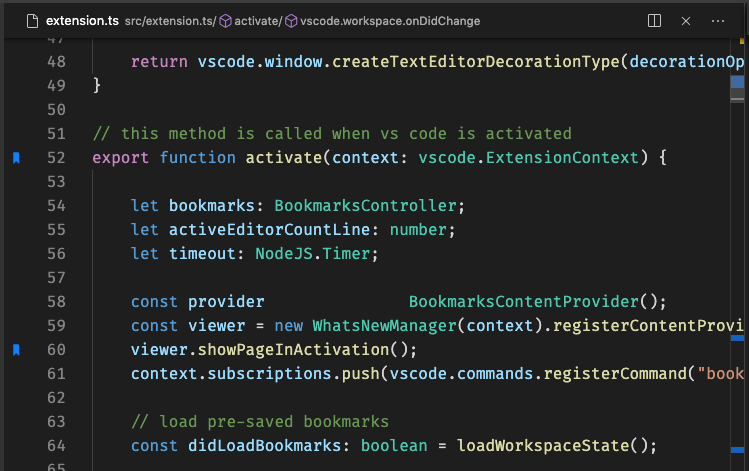

## Bladwijzers aan-/uitzetten

Je kunt eenvoudig bladwijzers aan- of uitzetten op elke positie. Je kunt zelfs **Labels** definiëren voor elke bladwijzer.

> Tip: Gebruik de sneltoets <kbd>Cmd</kbd> + <kbd>Alt</kbd> + <kbd>K</kbd>
